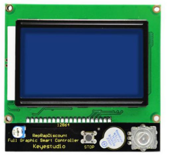
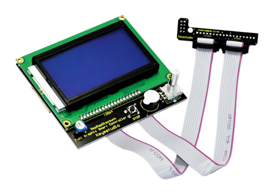

# KS0149 Keyestudio RAMPS1.4 / 12864 LCD Control Panel for 3D Printer

## 1. Introduction

This is a LCD control panel used in 3D printer, an extension accessory of RAMPS.

By using this panel, the printer can realize off-line printing function. That is to store the Gcode file of the 3D model to SD card, and then use the LCD control panel to print the file.

This is an updated version of Reprap smart controller.

## 2. Connection

**Note: This product needs work with adapter board and connection wire.**

